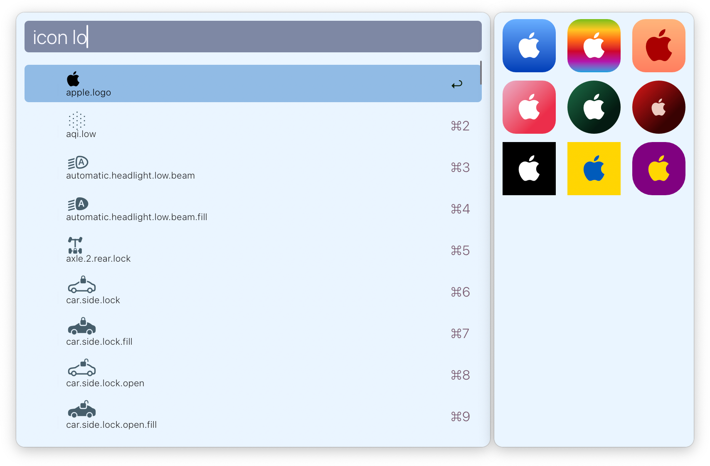
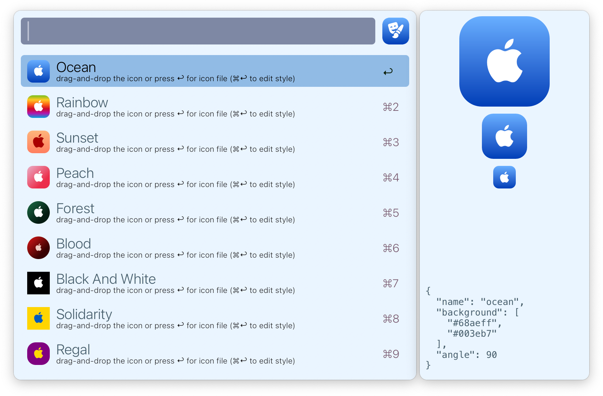
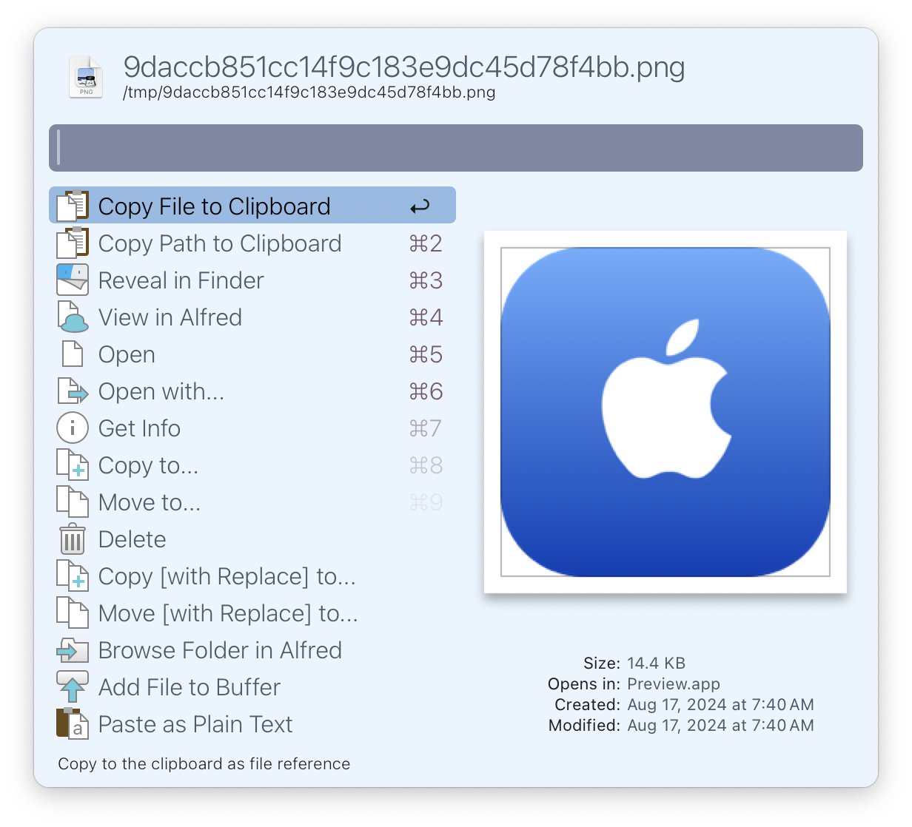
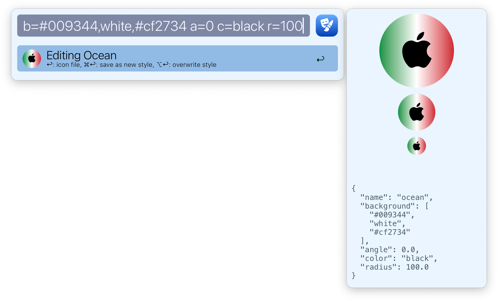

<h1 align="center">
  <br/>
  Icon Maker
</h1>

[Alfred](https://alfredapp.com) workflow for creating icons using
[SF Symbols](https://developer.apple.com/sf-symbols/).

## Installation
To install Icon Maker along with all other required programs, run the following
command in terminal:

```shell
curl -sL https://raw.githubusercontent.com/mr-pennyworth/alfred-icon-maker/main/install.sh | sh
```

Along with the workflow, the script above installs:
 - [AlfredExtraPane](https://github.com/mr-pennyworth/alfred-extra-pane):
   for showing the icons being generated (in SVG format) in Alfred.
 - [Inkscape](https://inkscape.org/): for generating the icons as PNGs.

## Usage
Search for the SF Symbol you want to use. Icon maker will list all matching
SF Symbols, and show a preview of icons using the selected symbol.
For example, `logo`:


Press `↩` to generate icons in the previewed styles. For each style, it shows
the icon in multiple sizes. This is the "style list view".


Press `↩` again to go to the generated 512x512 PNG file. Alternatively, you can
drag and drop the icon.


Press `⌘↩` in the style list view tweak the appearance of the icon by entering
the "style editing view" and typing the changes in Alfred in the format
`property=value`. Icon PNG as well as the multi-size preview is updated in real
time as you type.

The properties are:
 - `color` (or `c`): the color of the icon.
 - `background` (or `b`): a comma-separated list of colors for the background.
 - `angle` (or `a`): andle of the background gradient in degrees: 0 for top to
   bottom, 90 for left to right.
 - `radius` (or `r`): relative radius of icon corners: 0 for sharp corners, 100
   to make a circlular icon.
 - `size` (or `s`): percentage of icon size to the background size.

The colors can be any valid CSS color keyword, or hex color code.

Here's an example of creating a circular icon with Italian flag colors:
`b=#009344,white,#cf2734 a=0 c=black r=100`:


From the style editing view, you can directly access the icon by pressing `↩`
or by dragging and dropping the icon. You can overwrite the style by pressing
`option-enter` (`⌥↩`), or create a new style by pressing `command-enter` (`⌘↩`).

## Notes on SVG to PNG conversion
We rely on Inkscape to convert SVGs to PNGs:
 - ImageMagick wasn't able to produce transparent backgrounds correctly.
 - `librsvg` has a [known bug](https://gitlab.gnome.org/GNOME/librsvg/-/issues/414)
   where it can not handle the `dominant-baseline` of `text` SVG elements
   correctly. Without this, there is no way to vertically align text at the
   center of the icon. The suggested workaround of setting `dy="0.25em"` works
   only when the font size is exactly half of the icon size.
 - ChatGPT and Claude weren't able to correctly write a swift program that would
   load the SVG inside a `WKWebView` and then take a screenshot. The PNGs didn't
   have the correct dimensions, didn't have transparent background, and in some
   cases, didn't use the "SF Pro" font (essential for rendering SF Symbols)
   either.
   - Since `AlfredExtraPane` is able to correctly render the SVGs, it certainly
     seems possible to get the `WKWebView` approach to work. In the future, if
     we want to stop depending on Inkscape, we should revisit this.

## Related
 - [Alfred Icon Generator](https://github.com/NeighNeighNeigh/Alfred_IconGenerator)
   is the inspiration for this workflow. I wanted to explore how this workflow
   would be different if it used `AlfredExtraPane`'s real-time preview feature.
   In addition, I wanted the workflow to not require usage of the SF Symbols app.
 
## Credits
 - [Sybolist](https://github.com/marcbouchenoire/symbolist) for the SF Symbols
   JSON file.
